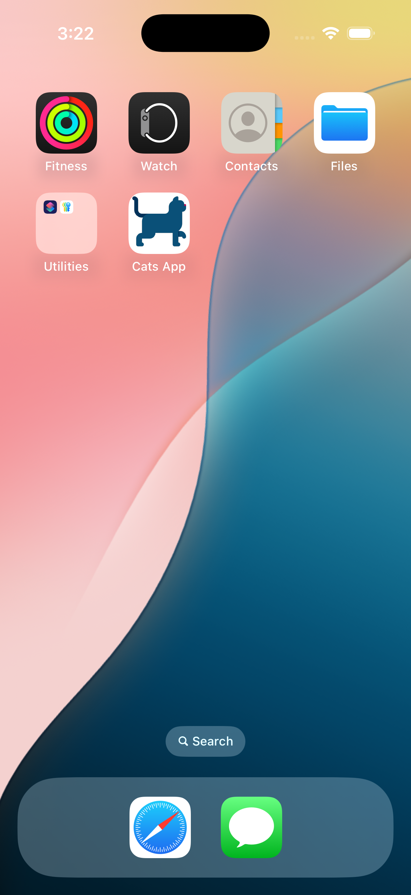
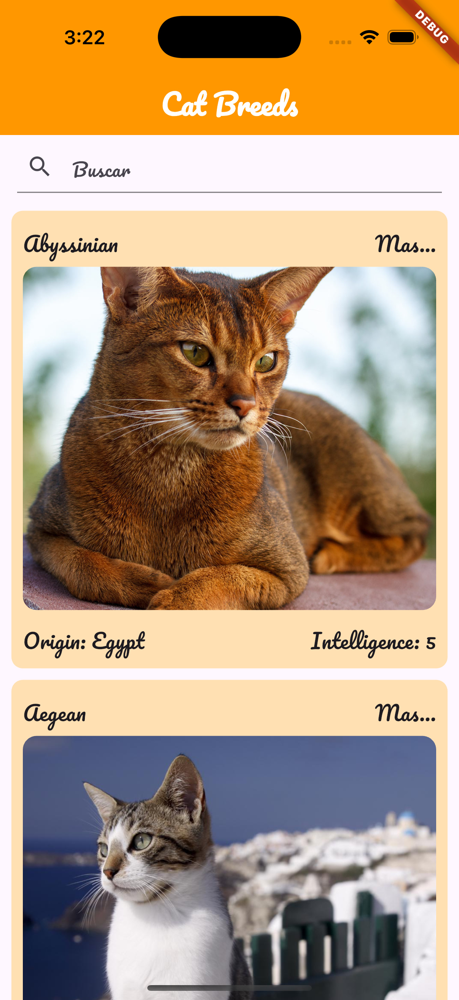

# Cats App
Aplicación en Flutter que brinda información de gatos.

## Capturas de Pantalla

  
  
  

## Descripción

Esta aplicación usa el API del siguiente link `https://api.thecatapi.comg/api`, la cual tiene como objetivo principal obtener y desplegar información sobre las razas de gatos y busqueda por raza.

## Instalación

1. Clona este repositorio: `git clone https://github.com/JustJaas/cat_app.git`
2. Navega a la carpeta del proyecto: `cd cat_app`
3. Instala las dependencias: `flutter pub get`

## Uso

1. Ejecuta la app en un emulador o dispositivo: `flutter run`
2. Interactúa con la app y explora sus funcionalidades.
